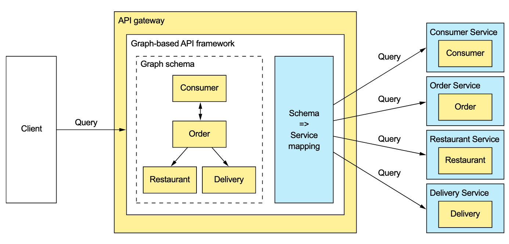
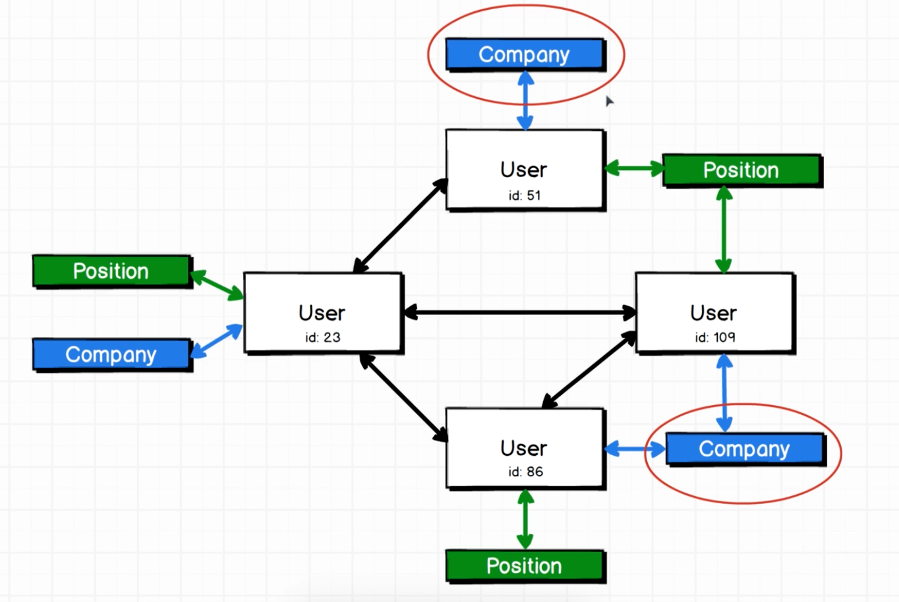

Project repo based on two courses [modern GraphQL complete course](https://www.udemy.com/course/modern-graphql-complete-guide) and [GraphQL with react](https://www.udemy.com/course/graphql-with-react-course). 

## WHY GRAPHQL?

There are some drawbacks of using REST, three of them that can be address by GraphQL are:

- <mark style="background: #BBFABBA6;">Fetching multiple resources in a single request is challenging.</mark> 

- <mark style="background: #BBFABBA6;"> It's sometimes difficult to map multiple update operation to HTTP verbs, because you need an URI for each specific operation.</mark> 
- <mark style="background: #BBFABBA6;">We are vulnerable to overfetching data. When fetching the entire dataset from a REST endpoint, we fetch all the data and we may need just one property of that dataset.</mark> 

GraphQL makes possible for a client-side to define queries that can avoid the need to make multiple requests to retrieve the same information. This can offer significant improvements in terms of the performance of constrained client-side devices and can also avoid the need to implement server-side aggregation.

Different clients need slightly different data. For instance, we can have a mobile app that requires way less data than a desktop app.
One way to tailor the data returned by the endpoint is to give the client the ability to specify the data they need. An  
endpoint can, for example, support query parameters such as the expand parameter,  
which specifies the related resources to return, and the field parameter, which specifies the fields of each resource to return.
The other option is to define multiple versions of this endpoint as part of applying the Backends for frontends pattern. This is a lot of work for just one of the many API endpoints that an app can needs to implement.
Implementing an API gateway with a REST API that supports a diverse set of clients well is time consuming. Consequently, you may want to consider using a graph-based API framework, such as GraphQL, that’s designed to support efficient data fetching. The key idea with graph-based API frameworks is that, as the image below shows,
the server’s API consists of a graph-based schema. The graph-based schema defines a set of nodes (types), which have properties (fields) and relationships with other nodes.
The client retrieves data by executing a query that specifies the required data in terms of the graph’s nodes and their properties and relationships. As a result, a client can retrieve the data it needs in a single round-trip to the API gateway.
Graph-based API technology has a couple of important benefits. It gives clients control over what data is returned. Consequently, developing a single API that’s flexible enough to support diverse clients becomes feasible. Another benefit is that even though  
the API is much more flexible, this approach significantly reduces the development effort. That’s because you write the server-side code using a query execution framework that’s designed to support API composition and projections. <mark style="background: #BBFABBA6;">It’s as if, rather than force clients to retrieve data via stored procedures that you need to write and maintain, you let them execute queries against the underlying database.</mark> 



Example and image from the book: Microservices Patterns, Chris  Richardson

## WHAT IS GRAPHQL?

GraphQL is a <mark style="background: #BBFABBA6;">query language </mark> for your API, and a server-side runtime for executing queries using a type system you define for your data. GraphQL isn't tied to any specific database or storage engine and is instead backed by your existing code and data.

A GraphQL service is created by defining types and fields on those types, then providing functions for each field on each type.

## HOW?

Let's Imagine we wanna get all the companies where the friends of User id:23 work in. Below the image of the graph we have and what we wanna fetch.



The query we will write to go from user id: 23 to friend's company's names is:

```javascript
query {
  user(id: "23") {
    friends {
      company {
         name
       }
    }
  }
}
```


